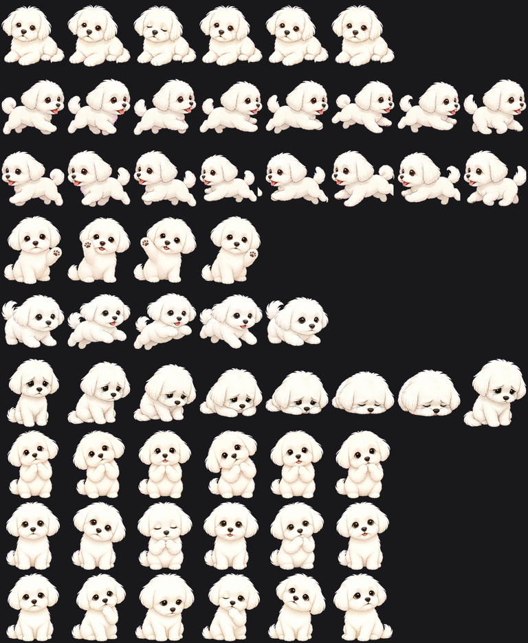
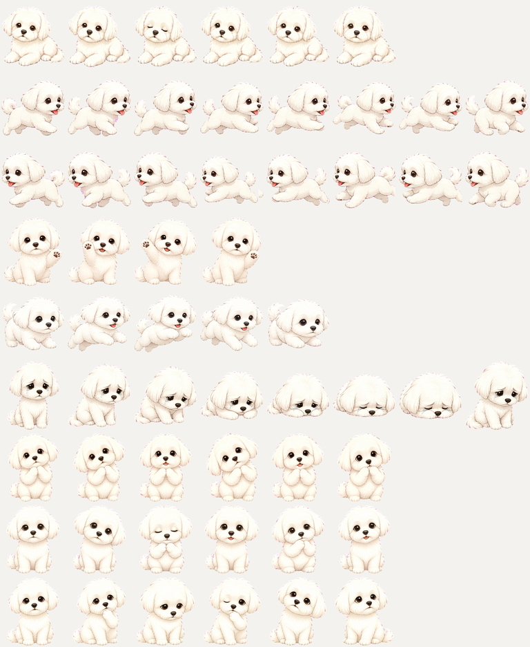
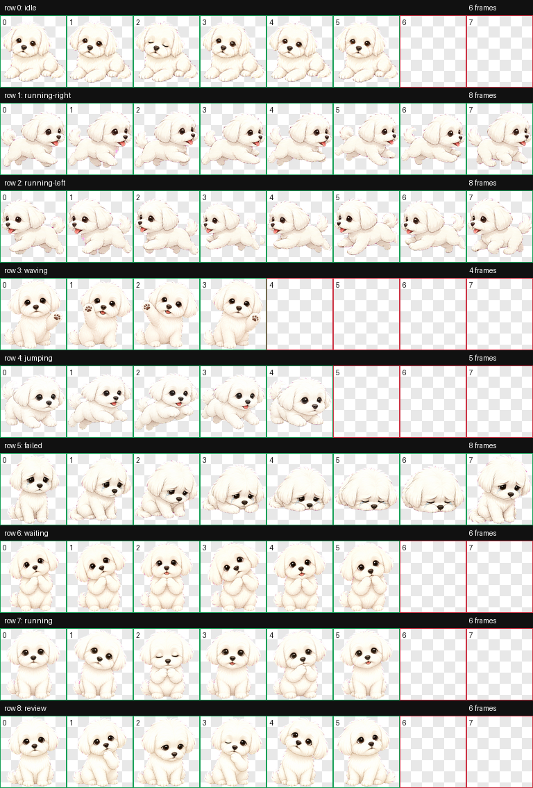

# Songi Codex Pet

Songi, the fluffy white Maltese!

This repository contains a Codex custom pet package:

- `pet.json`
- `spritesheet.webp`
- `install.sh`

## Preview







## Install

From this repository:

```bash
./install.sh
```

The installer copies the pet into:

```text
${CODEX_HOME:-$HOME/.codex}/pets/songi-pet
```

If `CODEX_HOME` is not set, that means:

```text
$HOME/.codex/pets/songi-pet
```

After installing, restart Codex or reload the pet picker if the new pet does not appear immediately.

## Install From A Fresh Clone

```bash
git clone https://github.com/ianchadson/songi-pet.git
cd songi-pet
./install.sh
```

## Manual Install

```bash
mkdir -p "${CODEX_HOME:-$HOME/.codex}/pets/songi-pet"
cp pet.json spritesheet.webp "${CODEX_HOME:-$HOME/.codex}/pets/songi-pet/"
```

## Verify

```bash
cat "${CODEX_HOME:-$HOME/.codex}/pets/songi-pet/pet.json"
ls -lh "${CODEX_HOME:-$HOME/.codex}/pets/songi-pet/spritesheet.webp"
```

## Uninstall

```bash
rm -rf "${CODEX_HOME:-$HOME/.codex}/pets/songi-pet"
```
